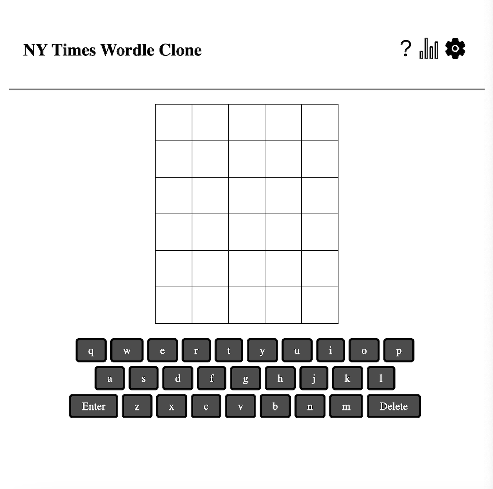

This project,https://adfreewordle.netlify.app/, provides a simular experience to the New York Time's daily Wordle puzzle, https://www.nytimes.com/games/wordle/index.html. Guess 3 to 9 letter words and do so ad free.

## Technology Used:
1. React
2. React Router
3. Faker
4. D3.js

## Running Locally:
1. npm install
2. npm start

## Features:
1. guess a 5 letter word in 6 guesses
2. use keyboard to type or click key buttons on on-screen keyboard
3. random word per game
4. when a word row is complete, keys indicate green when the letter is in the correct spot, yellow when the letter is in the word, and gray when it is not
5. undue letters via delete / backspace (except for the last letter, there is a bug)

## Things to Improve or Todo:
1. improve word selection by providing more than faker adjective words
2. store and display stats 
3. ensure mobile css effectivness 
4. update app without full page reload after a word is guessed or the word is not guessed
5. fix delete or backspace of the last letter in a row, checks for match instead right now
6. only check valid words

## Resources
1. https://fakerjs.dev/api/word.html#word
2. https://kamibrumi.medium.com/getting-started-with-react-d3-js-d86ccea05f08
3. https://laracasts.com/series/wordle-workshop
4. https://www.freecodecamp.org/news/how-to-get-started-with-d3-and-react-c7da74a5bd9f/